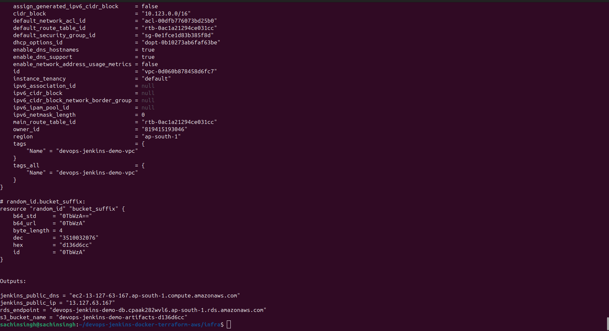
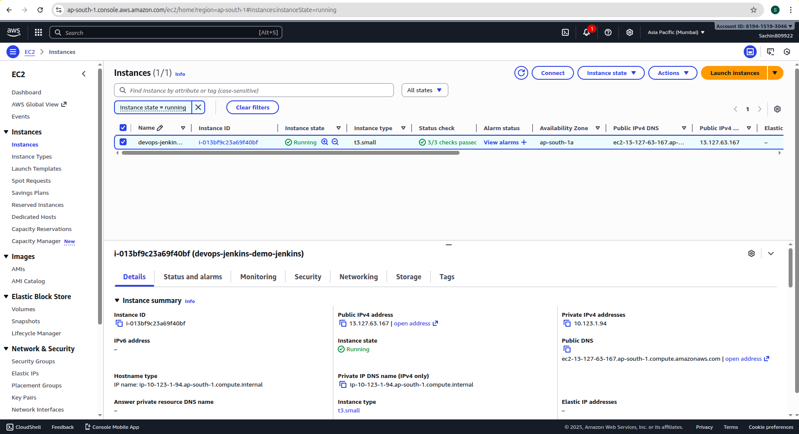
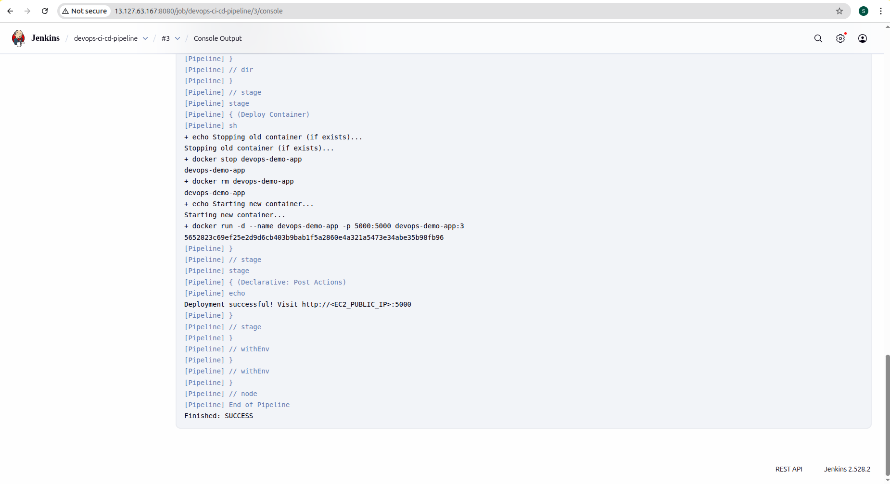
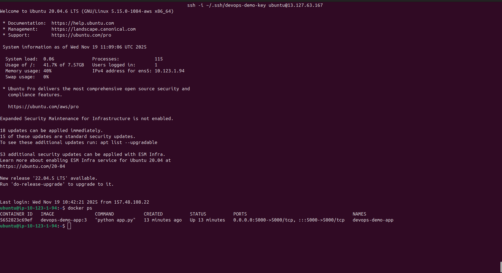
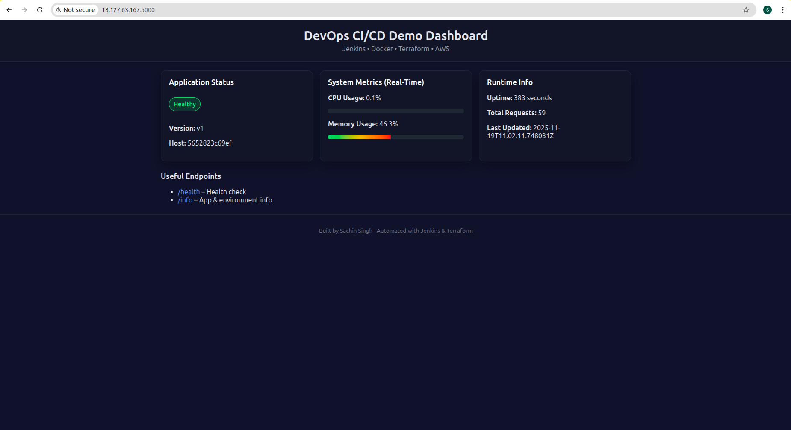
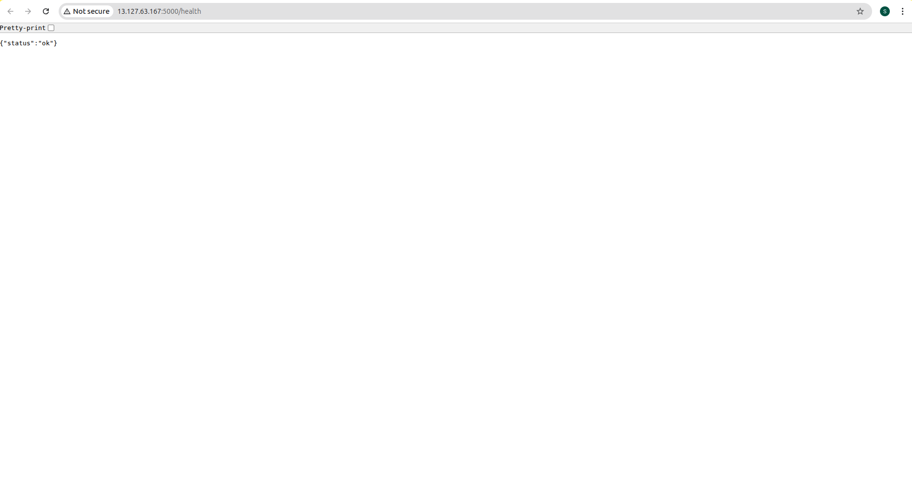

<div align="center">

# 🚀 **Real-Time DevOps CI/CD Pipeline Project**  
### *Jenkins • Docker • Terraform • AWS • GitHub Webhooks • Flask Dashboard*

A complete **Enterprise-Grade DevOps Pipeline** deploying a **Real-Time Monitoring Web App** using:

**Terraform → AWS → Jenkins Pipeline → Docker → GitHub Webhooks → EC2 Deployment**

</div>

---

# 📌 **1. Project Overview**

This project demonstrates a **real production-style DevOps workflow**:

- ✔ 100% Automated CI/CD Pipeline (Jenkins)
- ✔ Git Push → Auto Build → Auto Deploy on EC2  
- ✔ Real-Time Monitoring Dashboard (Flask)
- ✔ Dockerized Deployment  
- ✔ Terraform for AWS Infrastructure  
- ✔ GitHub Webhooks Integration  

This repository contains:

| Folder/File | Description |
|------------|-------------|
| `infra/` | Terraform for AWS resources |
| `app/` | Flask application + UI + APIs |
| `Jenkinsfile` | CI/CD Pipeline (Pipeline-as-Code) |
| `images/` | Architecture Diagram + Screenshots |

---

# 🛠 **2. Tech Stack**

| Category | Tools |
|----------|--------|
| Cloud | AWS (EC2, VPC, RDS, IAM, S3) |
| CI/CD | Jenkins (Pipeline-as-Code) |
| IaC | Terraform |
| Containers | Docker |
| Language | Python (Flask) |
| SCM | GitHub |
| OS | Ubuntu |

---

# 🏗 **3. Architecture Diagram**

                    ┌───────────────────┐
                    │   Developer       │
                    │   (Writes Code)   │
                    └─────────┬─────────┘
                              │  git push
                              ▼
                   ┌─────────────────────┐
                   │      GitHub         │
                   │  (Source Code Repo) │
                   └─────────┬──────────┘
                              │ Webhook Trigger
                              ▼
               ┌──────────────────────────────┐
               │            Jenkins            │
               │     (CI/CD Pipeline on EC2)  │
               ├──────────────────────────────┤
               │ 1. Checkout Code             │
               │ 2. Build Docker Image        │
               │ 3. Stop old container        │
               │ 4. Run new container         │
               └───────────┬──────────────────┘
                           │ SSH to EC2
                           ▼
         ┌─────────────────────────────────────────┐
         │               EC2 Instance              │
         │        (Docker Engine Installed)        │
         ├─────────────────────────────────────────┤
         │ Runs Flask App Container on Port 5000   │
         └──────────┬──────────────────────────────┘
                    │
                    ▼
         ┌────────────────────────────┐
         │   User Browser / Client   │
         │ http://EC2-PUBLIC-IP:5000 │
         └────────────────────────────┘


     ┌─────────────────────────────────────────────────┐
     │                  Terraform (IaC)                │
     │  Used to create AWS infra:                      │
     │   - VPC + Subnets                               │
     │   - EC2 Instance (Jenkins + App)                │
     │   - RDS PostgreSQL                              │
     │   - S3 Bucket                                   │
     │   - IAM Roles                                   │
     └─────────────────────────────────────────────────┘

---

# 🔄 **4. CI/CD Flow**

1. Developer pushes code → **GitHub**
2. GitHub Webhook notifies → **Jenkins**
3. Jenkins Pipeline:
   - Fetches latest code  
   - Builds Docker image  
   - (Optional) Pushes image to Docker Hub  
   - Stops old container  
   - Runs new container on EC2  
4. App instantly updates  
5. Available at:

👉 **http://\<EC2_PUBLIC_IP\>:5000**

---

# ☁️ **5. Terraform Infrastructure (`infra/`)**

Terraform automatically provisions:

- VPC + Subnets  
- Internet Gateway  
- Route Table  
- EC2 (Jenkins Server + App Deployment)  
- RDS PostgreSQL  
- S3 Bucket  
- IAM Roles & Policies  

### Terraform Commands

```bash
terraform init
terraform validate
terraform plan -out plan.tfplan
terraform apply "plan.tfplan"

```

---

# 🖥 **6. Real-Time Web Application (Flask)**

This project includes a **Real-Time DevOps Monitoring Dashboard** built using Flask.

It shows:

- 🔥 Live CPU Usage  
- 🔥 Live RAM Usage  
- 🔥 Uptime Counter  
- 🔥 App Version  
- 🔥 Hostname  
- 🔥 Total Request Count  
- 🔄 Auto-refresh every 2 seconds  

### API Endpoints

| Endpoint | Description |
|----------|-------------|
| `/` | UI Dashboard |
| `/health` | Health status |
| `/info` | App metadata |
| `/api/status` | Live stats (JSON) |

---

# 🐳 **7. Docker + Jenkins Deployment**

The Jenkins pipeline automatically executes:

- Checkout code from GitHub  
- Build Docker Image  
- (Optional) Push image to Docker Hub  
- Stop old container  
- Start new container on EC2  

### Check running containers on EC2

```bash
docker ps
```

---

# 📬 **8. GitHub Webhook Setup**

Follow these steps:

1. Go to your GitHub repository  
2. Click **Settings → Webhooks**  
3. Click **Add Webhook**  
4. Add this URL:

```
http://<EC2_PUBLIC_IP>:8080/github-webhook/
```

5. Content type: **application/json**  
6. Trigger: **Just the push event**  
7. Save the webhook

---

# 📸 **9. Screenshots**

### 1️⃣ Terraform Apply Output  


### 2️⃣ AWS EC2 (Jenkins Server)  


### 3️⃣ Jenkins Dashboard  


### 4️⃣ Jenkins Console (Docker Build + Deploy Success)  


### 5️⃣ Docker Container Running  


### 6️⃣ Real-Time Dashboard UI  


### 7️⃣ Health Endpoint  


---

# 🧪 **10. How to Run This Project**

### Clone Repo

```bash
git clone https://github.com/SACHIN-9922/devops-jenkins-docker-terraform-aws
```

### Terraform Deploy

```bash
cd infra
terraform init
terraform apply
```

### Access Application

```
http://<EC2_PUBLIC_IP>:5000
```

---

<div align="center">

⭐ If you found this project helpful, please give it a **GitHub Star**! ⭐

</div>

